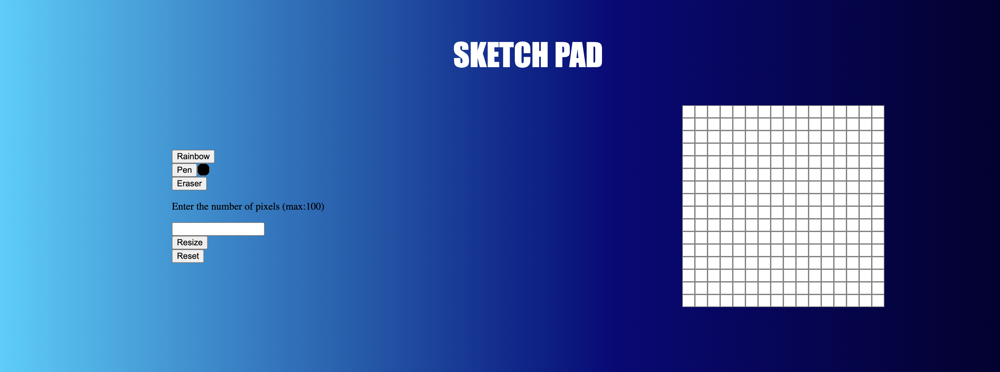
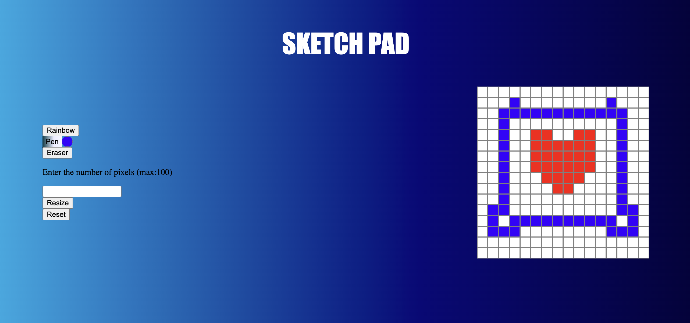

# Etch-a-Sketch

## Screenshot

    

    

The paint tool features
- Pen: Can choose multiple colors
- Rainbow pen: Random colors are generated for each square
- Eraser: We all make mistakes, undo a square color

## How to use
You can click or drag on each individual squares to paint.
By default, color is set to black but the color picker lets you customize your paint.
The default grid is 16x16 but you can update it by entering a grid size e.g: 50 and click the resize button

## Browser Support

Works on all modern browsers including:
- Chrome
- Firefox
- Safari
- Edge

## License

Free to use for personal and educational purposes.

## Author
Kevin Thomas

Created as a fun JavaScript project to practice DOM manipulation and CSS animations.
---

Enjoy the game! 🎮